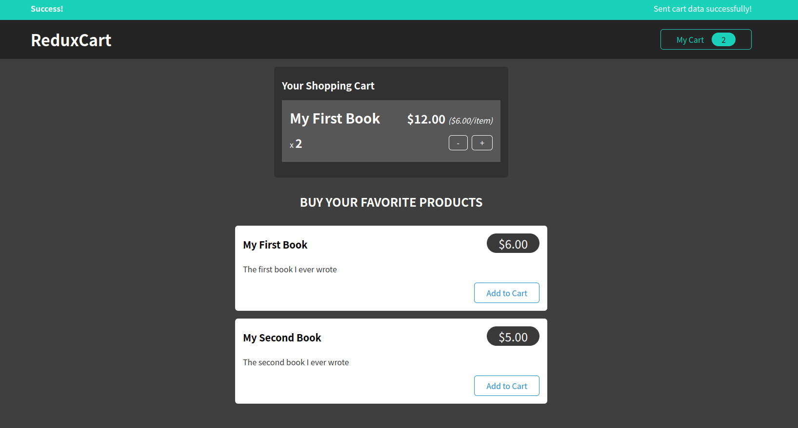

## Food Order
This application is a straightforward implementation that allows users to add products to a cart using React and Redux. It utilizes Firebase's Realtime Database as the underlying database. 

## Install

```sh
npm init
```

```sh
npm start
```

## Demo
<a href="https://soltonanna.github.io/add-to-cart-redux/" target="_blank"> Demo </a>